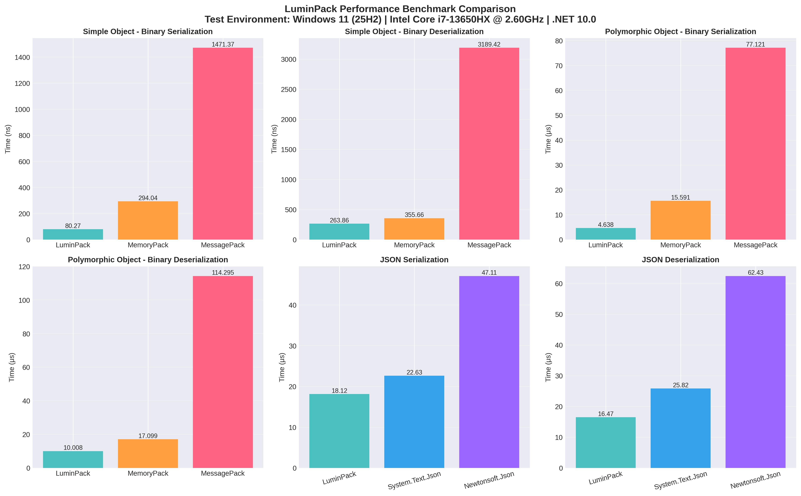

# **LuminPack**

## ⚡ 性能基准测试

> **测试环境**: Windows 11 (25H2) | Intel Core i7-13650HX @ 2.60GHz | .NET 10.0

### 📊 性能对比图表



### 🎯 性能数据总结

**二进制序列化性能对比**

| 测试场景 | LuminPack | MemoryPack | MessagePack | 性能优势 |
|---------|-----------|------------|-------------|---------|
| **简单对象序列化** | 80.27 ns | 294.04 ns | 1,471.37 ns | **3.6x ~ 18.3x** ⚡ |
| **简单对象反序列化** | 263.86 ns | 355.66 ns | 3,189.42 ns | **1.3x ~ 12.1x** ⚡ |
| **多态对象序列化** | 4.638 μs | 15.591 μs | 77.121 μs | **3.4x ~ 16.6x** ⚡ |
| **多态对象反序列化** | 10.008 μs | 17.099 μs | 114.295 μs | **1.7x ~ 11.4x** ⚡ |

**JSON 序列化性能对比**

| 测试场景 | LuminPack | System.Text.Json | Newtonsoft.Json | 性能优势 |
|---------|-----------|------------------|-----------------|---------|
| **JSON 序列化** | 18.12 μs | 22.63 μs | 47.11 μs | **1.2x ~ 2.6x** 🚀 |
| **JSON 反序列化** | 16.47 μs | 25.82 μs | 62.43 μs | **1.6x ~ 3.8x** 🚀 |

---

## 📖 简介

LuminPack是一款高性能序列化库，对于嵌套类，LuminPack比Memorypack，Messagepack快50%，200%。对于泛型类，LuminPack比Memorypack，Messagepack快400%。对于一些特殊集合，LuminPack甚至快上22倍。

LuminPack最初是专门为Unity开发的，为Unity在存档，网络等高性能场景下提供接近手写特定类解析器的性能，LuminPack性能如何快的原因也是如此。对于LuminPack的基础类型，LuminPack会直接解析写入解析器，与此同时，LuminPack大量学习并借鉴了MemoryPack对于特定于C#的内存操纵，并通过指针反射，内存映射实现更高性能。

本人没有写Readme的经验，因此本文借鉴了Memorypack的Readme写法。

除了性能，LuminPack包含MemoryPack绝大部分特性，对于仅包含LuminPack基础类型的数据，二者甚至可以互相序列化（好像不行了，没测试）。

### ✨ 主要特性

*   支持现代I / O api ( `ReadOnlySpan<byte>` ,  `ReadOnlySequence<byte>` )
*   更新支持至.Net10
*   基于增量源代码生成器的代码生成
*   同时支持二进制、Json
*   基于非托管内存的WriterBuffer
*   无反射
*   多态序列化
*   有限的版本容忍（快速/默认）和完全的版本容忍支持
*   循环引用序列化
*   AOT友好
*   反序列化缓存池
*   通过增量源代码生成器支持Unity

## 📦 Installation 安装

1. Nuget搜索LuminPack安装
2. 自行导入仓库的dll文件

## 🔮 后续更新计划

1.  Unity编辑器扩展，可视化生成文件
2.  内置压缩功能
3.  内置加密功能

## 🚀 Quick Start 快速开始

定义要序列化的结构体或类，并用 `[LuminPackable]` 属性对其进行注释。

```csharp
using LuminPack;

[LuminPackable]
public class Person
{
    public int Age { get; set; }
    public string Name { get; set; }
}
```

序列化代码将由c#源代码生成器功能生成，您可以查询生成的名为'命名空间+外层类名(如有)+ClassNameParser.g.cs'的文件查看详细代码。

调用 `LuminPackSerializer.Serialize<T>/Deserialize<T>` 序列化/反序列化二进制对象实例。

调用 `LuminPackSerializer.SerializeJson<T>/DeserializeJson<T>` 序列化/反序列化Json对象实例。

```csharp
var item = new Person { Age = 18, Name = "Light" };

var buffer = LuminPackPackSerializer.Serialize(item);
var bufferJson = LuminPackPackSerializer.SerializeJson(item);
var result = LuminPackSerializer.Deserialize<Person>(buffer);
var resultJson = LuminPackSerializer.DeserializeJson<Person>(buffer);
```

## 📋 LuminPack基础类型

默认情况下，LuminPack基础类型将实现最高性能

```
Int, UInt, Byte, Short, UShort, Long, ULong, 
Float, Double, Char, String, Decimal, Bool, 
Enum, Struct, Class, List, Array
```

## 🔧 内置支持的类型

默认情况下，这些类型可以被序列化：

*   .Net所有非托管类型 (`byte`, `int`, `bool`, `char`, `double`, etc.)
*   `string`, `decimal`, `Half`, `Int128`, `UInt128`, `Guid`, `Rune`, `BigInteger`
*   `TimeSpan`, `DateTime`, `DateTimeOffset`, `TimeOnly`, `DateOnly`, `TimeZoneInfo`
*   `Complex`, `Plane`, `Quaternion` `Matrix3x2`, `Matrix4x4`, `Vector2`, `Vector3`, `Vector4`
*   `Uri`, `Version`, `StringBuilder`, `Type`, `BitArray`, `CultureInfo`
*   `T[]`, `T[,]`, `T[,,]`, `T[,,,]`, `Memory<>`, `ReadOnlyMemory<>`, `ArraySegment<>`, `ReadOnlySequence<>`
*   `Nullable<>`, `Lazy<>`, `KeyValuePair<,>`, `Tuple<,...>`, `ValueTuple<,...>`
*   `List<>`, `LinkedList<>`, `Queue<>`, `Stack<>`, `HashSet<>`, `SortedSet<>`, `PriorityQueue<,>`
*   `Dictionary<,>`, `SortedList<,>`, `SortedDictionary<,>`, `ReadOnlyDictionary<,>`
*   `Collection<>`, `ReadOnlyCollection<>`, `ObservableCollection<>`, `ReadOnlyObservableCollection<>`, `ReadOnlyCollectionBuilder<>`
*   `IEnumerable<>`, `ICollection<>`, `IList<>`, `IReadOnlyCollection<>`, `IReadOnlyList<>`, `ISet<>`
*   `IDictionary<,>`, `IReadOnlyDictionary<,>`, `ILookup<,>`, `IGrouping<,>`,
*   `ConcurrentBag<>`, `ConcurrentQueue<>`, `ConcurrentStack<>`, `ConcurrentDictionary<,>`, `BlockingCollection<>`
*   Immutable collections (`ImmutableList<>`, etc.) and interfaces (`IImmutableList<>`, etc.)

## 🎯 定义 `[LuminPackable]` 数据

`[LuminPackable]` 可以注释到任何 `class` ,  `abstract class`  ,  `struct`  ,  `record` ,  `record struct` 和 `interface` 。如果类型 `struct` 或 `record struct` 不包含引用类型（c#非托管类型），则不使用任何直接从内存序列化/反序列化的规则，LuminPack会直接复制内存。

默认情况下， `[LuminPackable]` 序列化公共实例属性或字段。可以使用 `[LuminPackIgnore]` 删除序列化目标， `[LuminPackInclude]` 将私有成员提升为序列化目标。

```csharp
[LuminPackable]
public class MyClass
{
    [LuminPackInclude]
    private MyClass2 myClass;
}

[LuminPackable]
public class MyClass2
{
    [LuminPackInclude]
    private int num1;
    [LuminPackIgnore]
    public long num2;
    public short num3;
    public double num4;
    public float num5;
    public string[] strings;
}
```

LuminPack有39条诊断规则（ `LuminPack001` 到`LuminPack039` ）

LuminPack不序列化成员名或其他信息，而是按照声明的顺序序列化字段。如果类型是继承的，则按照父级→子级的内存布局顺序执行序列化。成员的顺序不能因反序列化而改变。关于模式演变，请参阅版本容忍部分。

默认的序列化顺序和布局是按照声明顺序的，如果想要更改，您可以使用 `[LuminPackOrder()]`

注：对于循环引用和完全版本容忍模式，每个字段和属性必须注释`[LuminPackOrder()]`

```csharp
// serialize Prop0 -> Prop1
[LuminPackable]
public class MyClass
{
    [LuminPackOrder(1)]
    public int Prop1 { get; set; }
    [LuminPackOrder(0)]
    public int Prop0 { get; set; }
}
```

LuminPack不依赖构造函数反序列化，因此您可以随意定义构造函数。

LuminPack默认支持 **`0 ~ 249`** 个成员字段

## 🔍 `[LuminPackableObject]`

\[LuminPackableObject]可以作用于任何字段以及属性，这将告诉LuminPackCodeGenerator不要直接解析该字段并写入Myclass的解析器，而是通过注册在LuminPack的Myclass2的解析器去解析。通常情况下，这会损失大概30%的性能，因此如果您遇到源代码生成器生成错误代码等情况，可以尝试用\[LuminPackableObject]标记字段或属性。

**以LuminPackable的示例代码为例**。在 **.Net8** 以上的平台, 对于嵌套类私有字段的解析，注释\[LuminPackInclude]将会 **正常工作**。但在 **.Net Standard2.1** 平台，**这将不会工作**。

例如以上示例代码，对于MyClass的 **"private MyClass2 myClass;"** 字段，使用\[LuminPackInclude]将会正常工作并解析MyClass2的所有 **public** 字段，但是不会解析Myclass2的 **private** 字段, 即使您在Myclass2的 **private** 字段标记\[LuminPackInclude]。如果想要正常工作，请使用\[LuminPackableObject]来取消基础类型的解析。

```csharp
[LuminPackable]
public class MyClass
{
    [LuminPackInclude]
    [LuminPackableObject] //这将使MyClass2的私有字段num1正常解析
    private MyClass2 myClass;
}
```

### 序列化回调

在实例方法或静态方法标记\[LuminPackOnSerialized]，\[LuminPackOnSerializing]，\[LuminPackOnDeserialized]，\[LuminPackOnDeserializing]等特性

```csharp
[LuminPackOnSerializing]
public static void OnSerializing()
{
    Console.WriteLine("OnSerializing");
}
    
[LuminPackOnSerialized]
public void OnSerialized()
{
    Console.WriteLine("OnSerialized");
}
    
[LuminPackOnDeserialized]
public void OnDeserialized()
{
    Console.WriteLine("OnDeserialized");
}
    
[LuminPackOnDeserializing]
public static void OnDeserializing()
{
    Console.WriteLine("OnDeserializing");
}
```

## 🔄 反序列化缓存池

LuminPack支持反序列化从缓存池取代new创建实例，减少GC开销。

LuminPack并不实现缓存池逻辑，需要用户自行实现，同时用户也应该注意Return实例，LuminPack并不追踪对象去Return

要启用缓存池，需要在静态方法上标记 **\[LuminPackPoolRent]** 特性

```csharp
[LuminPackPoolRent]
public static SimpleClass Rent()
{
    return this.Pool.Rent();
}
```

## 🎭 多态序列化

LuminPack支持序列化接口和抽象类对象，实现多态序列化。

LuminPack支持最低程度的自动收集继承类，对于标记了\[LuminPackable]特性的abstract，interface，LuminPack会自动收集符合以下规则的子类

```
规则：
1. 如果子类泛型参数数量超过基类，不收集
2. 如果子类泛型参数不是直接传递给基类（如 MyClass<U> : MyClassBase<T>），不收集
3. 如果子类有约束且和基类约束不一样，不收集
4. 如果基类被完全具象化（如 MyClassBase<int>），子类不能有泛型参数

允许的情况：
- MyClass<T> : MyClassBase<T> （泛型参数完全匹配，约束一致）
- MyClass : MyClassBase<int> （完全具体化，子类无泛型）

Id分配规则：从0开始递个递增，如果遇到[LuminPackUnion]显示注册过的Id，则跳过。
```

对于不收集的类型，LuminPack支持手动注册。与MemoryPack的Union相同。只有接口和抽象类允许使用 `[LuminPackUnion]` 属性进行注释。需要唯一的联合标记。

```csharp
// Annotate [LuminPackable] and inheritance types with [LuminPackUnion]
// Union also supports interface class
[LuminPackable]
[LuminPackUnion(0, typeof(Child1))]
[LuminPackUnion(1, typeof(Child2))]
public abstract class IUnionSample
{
}

[LuminPackable]
public class Child1 : IUnionSample
{
    public int num;
}

[LuminPackable]
public class Child2 : IUnionSample
{
    public string str;
}

IUnionSample data = new Child1() { num = 114514};

// Serialize
var buffer = LuminPackSerializer.Serialize(data);

// Deserialize
var result = LuminPackSerializer.Deserialize<IUnionSample>(buffer);

switch (result)
{
    case Child1 x:
        Console.WriteLine(x.num);
        break;
    case Child2 x:
        Console.WriteLine(x.str);
        break;
    default:
        break;
}
```

对于`LuminPackUnion`的Tag，支持 `0`  \~  `65535`， 对与`250`以下的性能更佳。因此推荐使用`250`以下的值作为Tag

## 🌐 跨程序集多态

LuminPack支持跨程序集多态序列化。如果程序集A定义了abstract类，程序集B的类继承了程序集A的abstract类，由于源生成器的限制，源生成器并不能分析到程序集B继承的子类，不会生成对应的序列化代码。此时需要用户手动注册，调用源生成器为A生成的abstract的Parser类的Register方法。以下是示例代码

```csharp
global::LuminPack.Generated.LuminPackBenchmark_SimpleClassBaseParser.Register(); 
//所有生成的Parser都在LuminPack.Generated命名空间下，生成的Parser的类名规则为：命名空间+外层类名+类名+Parser
```

Register方法接受6个参数，分别是Type，Id，二进制序列化函数指针，二进制反序列化函数指针，Json序列化函数指针，Json反序列化函数指针

用户需要手写几个静态函数

```csharp
private static unsafe void WriteLuminPackBenchmark_FooA(ref LuminPackWriter writer, ref global::LuminPackBenchmark.IFoo value)
{
    writer.WriteUnionHeader(0);
    writer.WritePolymorphismValue(LuminPackMarshal.As<global::LuminPackBenchmark.IFoo, global::LuminPackBenchmark.FooA>(ref value));
}

private static unsafe void ReadLuminPackBenchmark_FooA(ref LuminPackReader reader, ref global::LuminPackBenchmark.IFoo value)
{
    global::LuminPackBenchmark.FooA tempValue = default!;
    reader.ReadPolymorphismValue(ref tempValue);
    value = LuminPackMarshal.As<global::LuminPackBenchmark.FooA, global::LuminPackBenchmark.IFoo>(ref tempValue!);
}

private static unsafe void WriteJsonLuminPackBenchmark_FooA(ref global::LuminPack.Core.LuminPackJsonWriter writer, ref global::LuminPackBenchmark.IFoo value)
{
    writer.WriteObjectStart();
    writer.WritePropertyName(LuminPackConstUtf8.TypeU8);
    writer.WriteInt(0);
    writer.WritePropertyName(LuminPackConstUtf8.ValueU8);
    writer.WriteValue(ref LuminPackMarshal.As<global::LuminPackBenchmark.IFoo, global::LuminPackBenchmark.FooA>(ref value)!);
    writer.WriteObjectEnd();
}

private static unsafe void ReadJsonLuminPackBenchmark_FooA(ref global::LuminPack.Core.LuminPackJsonReader reader, ref global::LuminPackBenchmark.IFoo value)
{
    global::LuminPackBenchmark.FooA tempValue = default!;
    reader.ReadValue(ref tempValue);
    value = LuminPackMarshal.As<global::LuminPackBenchmark.FooA, global::LuminPackBenchmark.IFoo>(ref tempValue!);
}

// 最后调用Register方法
LuminPack.Generated.LuminPackBenchmark_IFooParser.Register(
    typeof(FooA), 100, 
    &WriteLuminPackBenchmark_FooA, 
    &ReadLuminPackBenchmark_FooA, 
    &WriteJsonLuminPackBenchmark_FooA, 
    &ReadJsonLuminPackBenchmark_FooA);
```

## 📝 版本容忍

在默认情况下 LuminPack的代码生成模式（ `GenerateType.Object` ）， 仅支持有限的模式演化。

*   如果数据类型是非托管数据，例如Struct（不包含引用类型）。不能更改数据
*   可以添加成员，不能删除成员。
*   不能更改成员名称
*   不能更改成员顺序
*   不能更改成员类型

```csharp
[LuminPackable]
public class MyClass
{
    public int Prop1 { get; set; }
    public long Prop2 { get; set; }
}

// Add is OK.
[LuminPackable]
public class MyClass
{
    public int Prop1 { get; set; }
    public long Prop2 { get; set; }
    public int? AddedProp { get; set; }
}

// Remove is NG.
[LuminPackable]
public class MyClass
{
    // public int Prop1 { get; set; }
    public long Prop2 { get; set; }
}

// Change order is NG.
[LuminPackable]
public class MyClass
{
    public long Prop2 { get; set; }
    public int Prop1 { get; set; }
}
```

当使用 `GenerateType.VersionTolerant` 时，它支持完全的版本容忍。

```csharp
[LuminPackable(GenerateType.VersionTolerant)]
public class VersionTolerantObject1
{
    [LuminPackOrder(0)]
    public int MyProperty0 { get; set; } = default;

    [LuminPackOrder(1)]
    public long MyProperty1 { get; set; } = default;

    [LuminPackOrder(2)]
    public short MyProperty2 { get; set; } = default;
}

[LuminPackable(GenerateType.VersionTolerant)]
public class VersionTolerantObject2
{
    [LuminPackOrder(0)]
    public int MyProperty0 { get; set; } = default;

    // deleted
    //[LuminPackOrder(1)]
    //public long MyProperty1 { get; set; } = default;

    [LuminPackOrder(2)]
    public short MyProperty2 { get; set; } = default;

    // added
    [LuminPackOrder(3)]
    public short MyProperty3 { get; set; } = default;
}
```

`GenerateType.VersionTolerant` 比 `GenerateType.Object` 性能更差，使用时请注意。

## 🔗 循环引用

```csharp
// to enable circular-reference, use GenerateType.CircularReference
[LuminPackable(GenerateType.CircularReference)]
public class Node
{
    [LuminPackOrder(0)]
    public Node? Parent { get; set; }
    [LuminPackOrder(1)]
    public Node[]? Children { get; set; }
}
```

`GenerateType.CircularReference` 具有与版本容忍相同的特性。

对象引用跟踪只对标记为 `GenerateType.CircularReference` 的对象进行。如果要跟踪任何其他对象，请对其进行包装。

## 💾 WriteBuffer池

LuminPack的序列化池通过Marshal申请非托管内存，这极大提高了Buffer扩容的性能。

因此，请确保所有WriteBuffer调用Dispose方法，以释放非托管内存。

LuminPack内置了高性能`ObjectPool`

```csharp
#if NET8_0_OR_GREATER
    private static readonly ObjectPool<ReusableLinkedArrayBufferWriter> _pool = 
        new(MaxPoolSize);
#else
    private static readonly ObjectPool<ReusableLinkedArrayBufferWriter> _pool = 
        new(new BufferWriterPolicy(), MaxPoolSize);
#endif

public static ReusableLinkedArrayBufferWriter Rent() => _pool.Rent();
    
public static void Return(ReusableLinkedArrayBufferWriter writer) => _pool.Return(writer);
```

.Net8以上版本，ObjectPool的对象需要继承IPooledObjectPolicy接口。

.Net Standard2.1版本，则需要单独定义继承继承IPooledObjectPolicy接口的类，通过依赖注入的方式。

## 🎮 Unity

LuminPack对于Unity有特殊优化，以达到.Net8版本相同的性能。

*   对于`List<>，Stack<>，Queue<>，Collection<>，ReadonlyCollection<>，ObserveableCollection<>，ReadonlyObserveableCollection<>，ReadOnlyCollectionBuilder<>` 的非托管泛型，LuminPack比MemoryPack快22倍 （1024数据量）
*   Serialize API和Deserialize API的类型检查优化，提高处理特殊数据的性能。

## 📐 二进制格式规范

端序必须 `Little Endian` 。

### 非托管结构

非托管结构是不包含引用类型的c#结构，类似于c#非托管类型的约束。序列化结构布局，包括填充。

### Object 对象

`(byte memberCount, [values...])`

对象头文件中的成员计数为1字节无符号字节。成员数允许 `0` 到 `249` ,  `255` 表示对象 `null` 。值存储成员数的内存包值。

### Version Tolerant Object 版本容忍对象

`(byte memberCount, [varint byte-length-of-values...], [values...])`

版本容忍对象与 Object 类似，但在头部包含值的字节长度。变长整数遵循以下规范：第一个有符号字节（sbyte）是值或类型代码，接下来的 X 个字节是具体值。其中，0 到 127 对应无符号字节值，-1 到 - 120 对应有符号字节值，-121 对应字节（byte），-122 对应有符号字节（sbyte），-123 对应无符号短整数（ushort），-124 对应短整数（short），-125 对应无符号整数（uint），-126 对应整数（int），-127 对应无符号长整数（ulong），-128 对应长整数（long）。

### Circular Reference Object 循环引用对象

`(byte memberCount, [varint byte-length-of-values...], varint referenceId, [values...])`\
`(250, varint referenceId)`

循环引用对象类似于版本容忍对象，但如果memberCount为250，则下一个变量（unsigned-int32）为referenceId。如果不是，则在字节长度值之后写入变量referenceId。

### String 字符串

`(int utf16-length, utf16-value)`\
`(int ~utf8-byte-count, int utf16-length, utf8-bytes)`

字符串有两种形式，UTF16和UTF8。如果第一个4byte有符号整数 `-1` ，表示null。 `0` ，表示空。UTF16与collection相同（序列化为 `ReadOnlySpan<char>` ， UTF16 -value的字节数为UTF16 -length \* 2）。如果第一个有符号整数<=  `-2` ，则value用UTF8编码。Utf8-byte-count以补码形式编码， `~utf8-byte-count` 检索字节数。下一个有符号整数是utf16-length，它允许 `-1` 表示未知长度。Utf8-bytes存储utf8-byte-count的字节数。

### Union 多态

`(byte tag, value)`\
`(250, ushort tag, value)`

第一个无符号字节是用于区分值类型或标志的标记， `0` 到 `249` 表示标记， `250` 表示下一个无符号短标记， `255` 表示 `null` 。

### Collection 集合

`(int length, [values...])`

集合头的数据计数为4字节有符号整数， `-1` 表示 `null` 。头字节存储数据长度。

### Tuple 元组

`(values...)`

元组是固定大小的非空值集合。 `KeyValuePair<TKey, TValue>` 和 `ValueTuple<T,...>` 被序列化为Tuple。

## 📄 License 许可证

This library is licensed under the MIT License.
